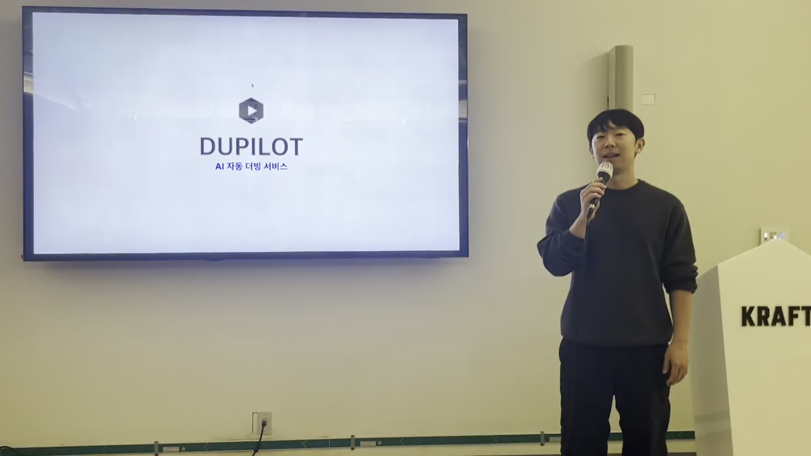

# 🎬 AI 자동 더빙 서비스 Dupilot

- ~~배포 URL : https://dupilot.com/~~ (배포 예정)
  > ❗ Notice: 현재 서비스 준비 중입니다.

 

## 프로젝트 소개

- 크래프톤 정글 10기 나만의 무기 1조의 AI 자동 더빙 서비스입니다.
- 한 번의 업로드로 영상 더빙 생성 → 브라우저에서 바로 편집 → 보이스를 사고팔 수 있는 마켓까지 이어지는 워크플로우를 제공합니다.
- WhisperX STT와 CosyVoice TTS를 활용한 고품질 자동 더빙과 실시간 편집 기능을 제공합니다.

 

## 프로젝트 시연

Dupilot 서비스의 주요 기능을 담은 시연 영상입니다.  
영상 업로드부터 자동 더빙, 편집 기능까지 한눈에 확인해보세요!

 

## 팀원 구성

|                       **진주영**                       |                         **정성원**                          |                        **안준**                         |                        **김현수**                        |                       **장윤호**                        |
| :----------------------------------------------------: | :---------------------------------------------------------: | :-----------------------------------------------------: | :------------------------------------------------------: | :-----------------------------------------------------: |
|         [@jjy3385](https://github.com/jjy3385)         |      [@seongwonjung](https://github.com/seongwonjung)       |        [@anjun206](https://github.com/anjun206)         |        [@kimhyunso](https://github.com/kimhyunso)        |        [@yunojang](https://github.com/yunojang)         |
|  |  |  |  |  |

 

## 1. 기술 스택

- **Frontend**: React 18, Vite, TypeScript, TailwindCSS, Radix UI, React Query, Zustand, Zod, MSW, Vitest/Playwright
- **Backend**: FastAPI, MongoDB, boto3(S3), SQS 기반 비동기 잡 큐, Uvicorn, Docker/Compose
- **STT/TTS Worker**: WhisperX STT, CosyVoice TTS, ffmpeg 파이프라인, CUDA 기반 Docker 멀티스테이지 빌드
- **Infra/툴링**: Docker Compose(dev/prod), GitHub Actions(CI), Husky + lint-staged, Prettier/ESLint
- **버전 및 이슈관리**: Github, Github Issues
- **협업 툴**: Notion (또는 사용 중인 툴)

 

## 2. 시스템 아키텍처

Dupilot 서비스는 Docker Compose 기반의 마이크로서비스 아키텍처로 구성되었습니다.  
Frontend는 React/Vite로 프로젝트 생성·목록·편집 UI와 타임라인/파형 기반 더빙 편집 기능을 제공합니다.  
Backend는 FastAPI로 인증/프로젝트/작업 API 게이트웨이 역할을 하며, MongoDB에 데이터를 저장하고 S3에 파일을 관리합니다.  
SQS를 통해 STT/TTS 파이프라인을 트리거하며, STT-TTS-Worker는 WhisperX로 음성 인식 → 번역/싱크 → CosyVoice 등 TTS로 합성 → ffmpeg로 mux하여 더빙 영상/오디오를 산출합니다.  
공유 리소스는 `data/`와 `models/` 볼륨으로 입력/중간/출력/모델 캐시를 관리합니다.

 

## 3. 커밋 컨벤션

| 태그       | 설명                                                            |
| ---------- | --------------------------------------------------------------- |
| `feat`     | 새로운 기능 추가                                                |
| `fix`      | 버그 수정                                                       |
| `docs`     | 문서 수정 (README 등)                                           |
| `style`    | 코드 포맷팅, 세미콜론 누락 등 (기능 변경 없음)                  |
| `refactor` | 코드 리팩토링 (기능 변경 없음)                                  |
| `test`     | 테스트 코드 추가 및 리팩토링                                    |
| `chore`    | 빌드 설정, 패키지 매니저 등 기타 변경                           |
| `merge`    | 브랜치 병합 작업 (e.g. `feat/auth` → `develop`), 충돌 해결 포함 |

 

## 4. 역할 분담

### 🎯 진주영

- (역할 분담 내용을 여기에 작성해주세요)

### 🎨 정성원

- (역할 분담 내용을 여기에 작성해주세요)

### 🚀 안준

- (역할 분담 내용을 여기에 작성해주세요)

### 💻 김현수

- (역할 분담 내용을 여기에 작성해주세요)

### 🔧 장윤호

- (역할 분담 내용을 여기에 작성해주세요)

 

## 5. 개발 기간

- 전체 개발 기간 : 2025.10.24 ~ 2025.11.29
- 아이디어 선정 : (기간을 추가해주세요)
- MVP 제작 기간 : (기간을 추가해주세요)
- 폴리싱 : (기간을 추가해주세요)

 

## 6. 주요 기능

### [영상 자동 더빙]

- 영상/오디오 업로드 후 STT → 번역 → TTS → 오디오/영상 mux까지 자동 처리됩니다.
- Job 큐(SQS) 기반 비동기 처리로 대용량 파일도 안정적으로 처리합니다.
- 결과 메타데이터와 파일 경로를 API로 반환하여 실시간으로 진행 상황을 확인할 수 있습니다.

 

### [에디터]

- 브라우저에서 타임라인·파형을 보며 클립 단위로 편집할 수 있습니다.
- 프리뷰 재생, 구간 선택/수정 기능을 제공합니다.
- 추후 멀티트랙·다국어 확장을 위한 구조로 설계되었습니다.

 

### [보이스 마켓]

- 커스텀 보이스 업로드/적용을 위한 마켓 플레이스 컨셉입니다.
- 향후 거래/적용 플로우 연동 예정입니다 (보이스 메타데이터 관리 포함).

 
